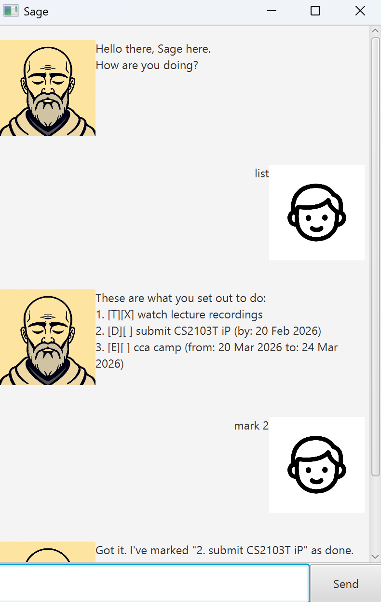

# Sage

_Sage_ is a task tracking chatbot, with functionalities such as searching and automatic sorting of tasks.

Developed as part of NUS module CS2103T's greenfield individual Java project: [Project Duke](https://nus-cs2103-ay2526-s2.github.io/website/se-book-adapted/projectDuke/index.html).

---
### Sage
_Sage_ is an old man who spends his days by the sea, letting the breeze carry his thoughts.
If you ask nicely, he'll help you keep track of your todolist—with quiet wisdom and
zero judgment. He prefers the simple things in life, much like this task tracker.

### 3 types of tasks:
- Todo (task description)
- Deadline (task description + deadline)
- Event (task description + start date + end date)

### Features
- Ability to **list** all tasks
- Ability to **mark** tasks as complete
- Ability to **unmark** tasks as incomplete
- Ability to **delete** tasks
- Ability to **find** tasks matching keywords
- Automatic sorting by task type, completion status, date and alphabetical order

For more details, do refer to the [Sage User Guide](https://synh.github.io/ip/).